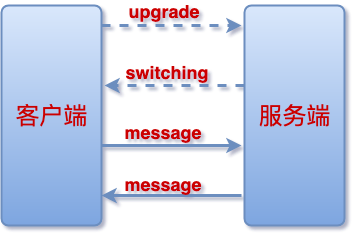
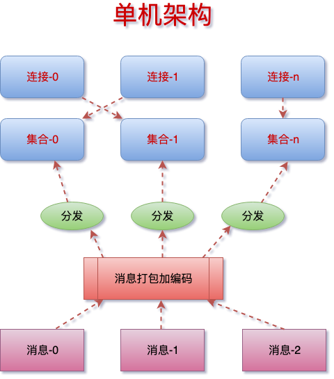
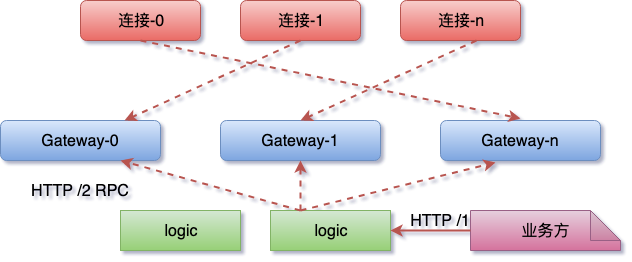
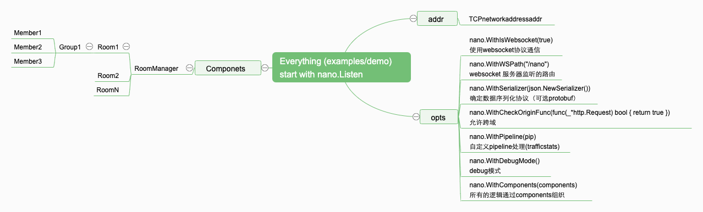
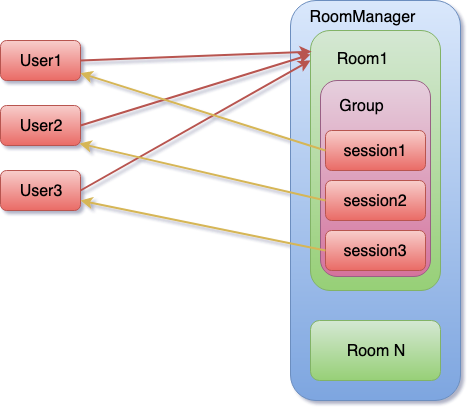
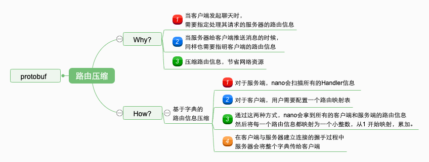
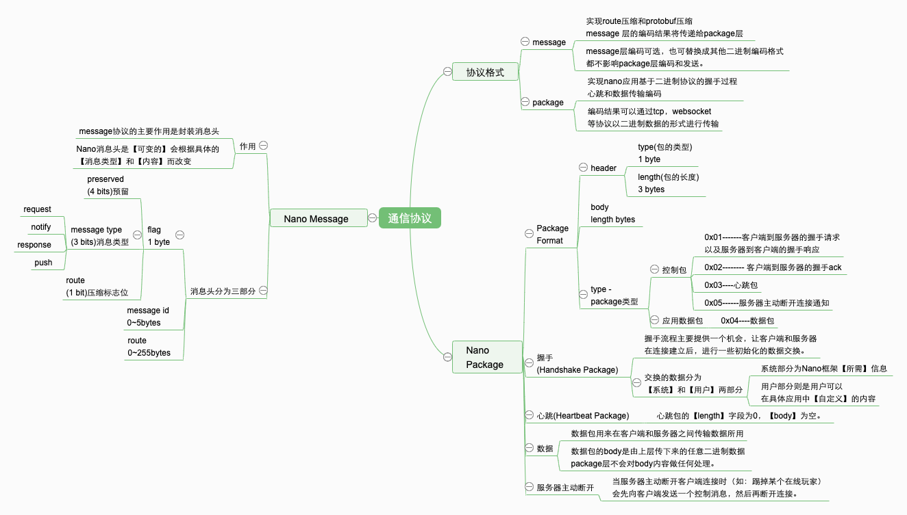
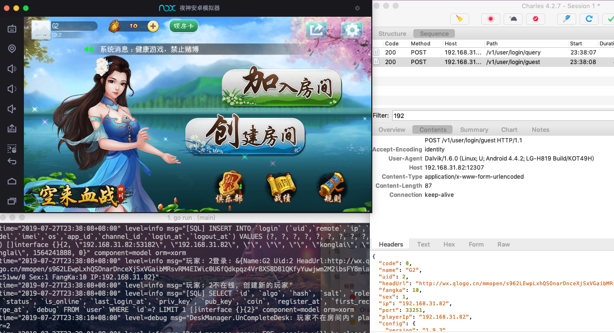

# 探索基于 Golang 的分布式应用

### NANO 的设计与源码分析(Lightweight, facility, high performance golang based game server framework)

**为啥调研它？**
* [NANO](https://github.com/lonng/nano) 由 PingCAP 团队成员 [Lonng](https://github.com/lonng) 开发并维护。作者也是 [TiDB](https://github.com/pingcap/tidb) 活跃贡献者。代码质量应该是不错的。

**NANO通信协议的设计分析**

NANO通信协议的设计主要是参考网易的 [pomelo 协议格式](https://github.com/NetEase/pomelo/wiki/%E5%8D%8F%E8%AE%AE%E6%A0%BC%E5%BC%8F)，NANO 也因此支持路由压缩。
* `protocol.js` 可以算做是对 [pomelo-protocol](https://github.com/NetEase/pomelo-protocol) 的拷贝。
* `nano-websocket-client.js` 可以算做是对 [pomelo-client.js](https://github.com/NetEase/chatofpomelo-websocket/blob/master/web-server/public/js/lib/components/pomelonode-pomelo-jsclient-websocket/lib/pomelo-client.js) 的拷贝😝。
  * `nano-websocket-client.js` 阉割了一些。`protobuf` 解析部分被阉割了，到时侯用的时候加上就好。**应用为王!!!**

JS & WebSocket & 二进制
* [Unicode®字符百科](https://unicode-table.com/cn/#control-character)
* [进制转换-秒懂](https://jingyan.baidu.com/article/597a0643614568312b5243c0.html)
* [WebSocket 二进制传输基础准备-Unicode转UTF16和UTF8](https://juejin.im/post/5ca5c689f265da30ca24a960)
* [你还在用charCodeAt那你就out了](https://github.com/akira-cn/FE_You_dont_know/issues/4)
* [从 IM 通信 Web SDK 来看如何提高代码可维护性与可扩展性](https://juejin.im/post/5c49f16b51882523ea6e0ef1)
* [WebSocket 协议 RFC 文档（全中文翻译）](https://juejin.im/post/5c6b7366e51d45016527d648)
* [二进制数组实战 - 纯前端导出Excel文件](https://juejin.im/post/5c31a5086fb9a04a102f6f50)
* [WebSocket 二进制数据传输基础准备工作](https://juejin.im/post/5ca43ed2f265da30b3409645)

**TODO-LIST**(以下列表并非阅读顺序)

**interface.go(package nano)**
- [x] `var VERSION = "0.5.0"`
- [ ] `func Listen(addr string, opts ...Option)`
- [ ] `func Shutdown()`

**group.go(package nano)**
- [ ] `type SessionFilter func(*session.Session) bool`
- [ ] `type Group struct`
- [ ] `func NewGroup(n string) *Group`
- [ ] `func (c *Group) Member(uid int64) (*session.Session, error)`
- [ ] `func (c *Group) Members() []int64`
- [ ] `func (c *Group) Multicast(route string, v interface{}, filter SessionFilter) error`
- [ ] `func (c *Group) Broadcast(route string, v interface{}) error`
- [ ] `func (c *Group) Contains(uid int64) bool`
- [ ] `func (c *Group) Add(session *session.Session) error`
- [ ] `func (c *Group) Leave(s *session.Session) error`
- [ ] `func (c *Group) LeaveAll() error`
- [ ] `func (c *Group) Count() int`
- [ ] `func (c *Group) isClosed() bool`
- [ ] `func (c *Group) Close() error`

**options.go(package nano)**
- [ ] `type Option func(*cluster.Options)`
- [ ] `func WithPipeline(pipeline pipeline.Pipeline) Option`
- [ ] `func WithAdvertiseAddr(addr string, retryInterval ...time.Duration) Option`
- [ ] `func WithClientAddr(addr string) Option`
- [ ] `func WithMaster() Option`
- [ ] `func WithGrpcOptions(opts ...grpc.DialOption) Option`
- [ ] `func WithComponents(components *component.Components) Option`
- [ ] `func WithHeartbeatInterval(d time.Duration) Option`
- [ ] `func WithCheckOriginFunc(fn func(*http.Request) bool) Option`
- [ ] `func WithDebugMode() Option`
- [ ] `func WithDictionary(dict map[string]uint16) Option`
- [ ] `func WithWSPath(path string) Option`
- [ ] `func WithTimerPrecision(precision time.Duration) Option`
- [ ] `func WithSerializer(serializer serialize.Serializer) Option`
- [ ] `func WithLabel(label string) Option`
- [ ] `func WithIsWebsocket(enableWs bool) Option`
- [ ] `func WithTSLConfig(certificate, key string) Option`
- [ ] `func WithLogger(l log.Logger) Option`

**errors.go(package nano)**
- [ ] `ErrCloseClosedGroup   = errors.New("close closed group")`
- [ ] `ErrClosedGroup        = errors.New("group closed")`
- [ ] `ErrMemberNotFound     = errors.New("member not found in the group")`
- [ ] `ErrSessionDuplication = errors.New("session has existed in the current group")`
---------
**base.go(package component)[component/]**
- [ ] `type Base struct`
- [ ] `func (c *Base) Init`
- [ ] `func (c *Base) AfterInit`
- [ ] `func (c *Base) BeforeShutdown`
- [ ] `func (c *Base) Shutdown`

**component.go(package component)[component/]**
- [ ] `type Component interface`

**hub.go(package component)[component/]**
- [ ] `type CompWithOptions struct`
- [ ] `type Components struct`
- [ ] `func (cs *Components) Register(c Component, options ...Option)`
- [ ] `func (cs *Components) List() []CompWithOptions`

**method.go(package component)[component/]**
- [ ] `func isExported(name string) bool`
- [ ] `func isExportedOrBuiltinType(t reflect.Type) bool`
- [ ] `func isHandlerMethod(method reflect.Method) bool`

**options.go(package component)[component/]**
- [ ] `type options struct`
- [ ] `type Option func(options *options)`
- [ ] `func WithName(name string) Option`
- [ ] `func WithNameFunc(fn func(string) string) Option`
- [ ] `func WithSchedulerName(name string) Option`

**service.go(package component)[component/]**
- [ ] `type Handler struct`
- [ ] `type Service struct`
- [ ] `type func NewService(comp Component, opts []Option) *Service`
- [ ] `func (s *Service) suitableHandlerMethods(typ reflect.Type) map[string]*Handler`
- [ ] `func (s *Service) ExtractHandler() error`
------------------
**lifetime.go(package session)[session/]**
- [ ] `type LifetimeHandler func(*Session)`
- [ ] `type lifetime struct`
- [ ] `var Lifetime = &lifetime{}`
- [ ] `func (lt *lifetime) OnClosed(h LifetimeHandler)`
- [ ] `func (lt *lifetime) Close(s *Session)`

**router.go(package session)[session/]**
- [ ] `type Router struct`
- [ ] `func newRouter() *Router`
- [ ] `func (r *Router) Bind(service, address string)`
- [ ] `func (r *Router) Find(service string) (string, bool)`

**session.go(package session)[session/]**
- [ ] `type NetworkEntity interface`
- [ ] `var ErrIllegalUID = errors.New("illegal uid")`
- [ ] `type Session struct`
- [ ] `func New(entity NetworkEntity) *Session`
- [ ] `func (s *Session) NetworkEntity() NetworkEntity`
- [ ] `func (s *Session) Router() *Router`
- [ ] `func (s *Session) RPC(route string, v interface{}) error`
- [ ] `func (s *Session) Push(route string, v interface{}) error`
- [ ] `func (s *Session) Response(v interface{}) error`
- [ ] `func (s *Session) ResponseMID(mid uint64, v interface{}) error`
- [ ] `func (s *Session) ID() int64`
- [ ] `func (s *Session) UID() int64`
- [ ] `func (s *Session) LastMid() uint64`
- [ ] `func (s *Session) Bind(uid int64) error`
- [ ] `func (s *Session) Close()`
- [ ] `func (s *Session) RemoteAddr() net.Addr`
- [ ] `func (s *Session) Remove(key string)`
- [ ] `func (s *Session) Set(key string, value interface{})`
- [ ] `func (s *Session) HasKey(key string) bool`
- [ ] `func (s *Session) Int(key string) int`
- [ ] `func (s *Session) Int8(key string) int8`
- [ ] `func (s *Session) Int16(key string) int16`
- [ ] `func (s *Session) Int32(key string) int32`
- [ ] `func (s *Session) Int64(key string) int64`
- [ ] `func (s *Session) Uint(key string) uint`
- [ ] `func (s *Session) Uint8(key string) uint8`
- [ ] `func (s *Session) Uint16(key string) uint16`
- [ ] `func (s *Session) Uint32(key string) uint32`
- [ ] `func (s *Session) Uint64(key string) uint64`
- [ ] `func (s *Session) Float32(key string) float32`
- [ ] `func (s *Session) Float64(key string) float64`
- [ ] `func (s *Session) String(key string) string`
- [ ] `func (s *Session) Value(key string) interface{}`
- [ ] `func (s *Session) State() map[string]interface{}`
- [ ] `func (s *Session) Restore(data map[string]interface{})`
- [ ] `func (s *Session) Clear()`
----------------
**connection.go(package service)[service/]**
- [ ] `var Connections = newConnectionService()`
- [ ] `type connectionService struct`
- [ ] `func newConnectionService() *connectionService`
- [ ] `func (c *connectionService) Increment`
- [ ] `func (c *connectionService) Decrement`
- [ ] `func (c *connectionService) Count`
- [ ] `func (c *connectionService) Reset`
- [ ] `func (c *connectionService) SessionID`
----------------
**serialize.go(package serialize)[serialize/]**
- [ ] `type Marshaler interface`
- [ ] `type Unmarshaler interface`
- [ ] `type Serializer interface`

**json.go(package json)[serialize/json/]**
- [ ] `type Serializer struct`
- [ ] `func NewSerializer() *Serializer`
- [ ] `func (s *Serializer) Marshal(v interface{}) ([]byte, error)`
- [ ] `func (s *Serializer) Unmarshal(data []byte, v interface{}) error`

**protobuf.go(package json)[serialize/protobuf/]**
- [ ] `var ErrWrongValueType = errors.New("protobuf: convert on wrong type value")`
- [ ] `type Serializer struct`
- [ ] `func NewSerializer() *Serializer`
- [ ] `func (s *Serializer) Marshal(v interface{}) ([]byte, error)`
- [ ] `func (s *Serializer) Unmarshal(data []byte, v interface{}) error`
------------------
**scheduler.go(package scheduler)[scheduler/]**
- [ ] `const messageQueueBacklog = 1 << 10`
- [ ] `const sessionCloseBacklog = 1 << 8`
- [ ] `type LocalScheduler interface`
- [ ] `type Task func()`
- [ ] `type Hook func()`
- [ ] `var chDie = make(chan struct{})`
- [ ] `var chExit = make(chan struct{})`
- [ ] `var chTasks = make(chan Task, 1<<8)`
- [ ] `var started int32`
- [ ] `var closed  int32`
- [ ] `func try(f func())`
- [ ] `func Sched()`
- [ ] `func Close()`
- [ ] `func PushTask(task Task)`

**timer.go(package scheduler)[scheduler/]**
- [ ] `const infinite = -1`
- [ ] `var timerManager = &struct`
- [ ] `type TimerFunc func()`
- [ ] `type TimerCondition interface`
- [ ] `type Timer struct`
- [ ] `func init()`
- [ ] `func (t *Timer) ID() int64`
- [ ] `func (t *Timer) Stop()`
- [ ] `func safecall(id int64, fn TimerFunc)`
- [ ] `func cron()`
- [ ] `func NewTimer(interval time.Duration, fn TimerFunc) *Timer`
- [ ] `func NewCountTimer(interval time.Duration, count int, fn TimerFunc) *Timer`
- [ ] `func NewAfterTimer(duration time.Duration, fn TimerFunc) *Timer`
- [ ] `func NewCondTimer(condition TimerCondition, fn TimerFunc) *Timer`
-------------------
**pipeline.go(package pipeline)[pipeline/]**
- [ ] `type Message = message.Message`
- [ ] `type Func func(s *session.Session, msg *message.Message) error`
- [ ] `type Pipeline interface`
- [ ] `type pipeline struct`
- [ ] `type Channel interface`
- [ ] `type pipelineChannel struct`
- [ ] `func New() Pipeline`
- [ ] `func (p *pipeline) Outbound() Channel`
- [ ] `func (p *pipeline) Inbound() Channel`
- [ ] `func (p *pipelineChannel) PushFront(h Func)`
- [ ] `func (p *pipelineChannel) PushBack(h Func)`
- [ ] `func (p *pipelineChannel) Process(s *session.Session, msg *message.Message) error`
-----------------
**codec.go(package codec)[internal/codec/]**
- [ ] `const HeadLength = 4`
- [ ] `MaxPacketSize = 64 * 1024`
- [ ] `var ErrPacketSizeExcced = errors.New("codec: packet size exceed")`
- [ ] `type Decoder struct`
- [ ] `func NewDecoder() *Decoder`
- [ ] `func (c *Decoder) forward() error`
- [ ] `func (c *Decoder) Decode(data []byte) ([]*packet.Packet, error)`
- [ ] `func Encode(typ packet.Type, data []byte) ([]byte, error)`
- [ ] `func bytesToInt(b []byte) int`
- [ ] `func intToBytes(n int) []byte`

**env.go(package env)[internal/env/]**
- [ ] `var Wd string`
- [ ] `var Die chan bool`
- [ ] `var Heartbeat time.Duration`
- [ ] `var CheckOrigin func(*http.Request) bool`
- [ ] `var Debug bool`
- [ ] `var WSPath string`
- [ ] `var TimerPrecision = time.Second`
- [ ] `var GlobalTicker *time.Ticker`
- [ ] `var Serializer serialize.Serializer`
- [ ] `var GrpcOptions = []grpc.DialOption{grpc.WithInsecure()}`
- [ ] `func init()`

**logger.go(package log)[internal/log/]**
- [ ] `type Logger interface`
- [ ] `func init()`
- [ ] `var Println func(v ...interface{})`
- [ ] `var Fatal   func(v ...interface{})`
- [ ] `var Fatalf  func(format string, v ...interface{})`
- [ ] `func SetLogger(logger Logger)`

**message.go(package message)[internal/message/]**
- [ ] `type Type byte`
- [ ] `const Request  Type = 0x00`
- [ ] `const Notify = 0x01`
- [ ] `const Response= 0x02`
- [ ] `const Push = 0x03`
- [ ] `const msgRouteCompressMask = 0x01`
- [ ] `const msgTypeMask = 0x07`
- [ ] `const msgRouteLengthMask = 0xFF`
- [ ] `const msgHeadLength = 0x02`
- [ ] `var types = map[Type]string`
- [ ] `func (t Type) String() string`
- [ ] `var routes = make(map[string]uint16)`
- [ ] `var codes  = make(map[uint16]string)`
- [ ] `var ErrWrongMessageType  = errors.New("wrong message type")`
- [ ] `var ErrInvalidMessage    = errors.New("invalid message")`
- [ ] `var ErrRouteInfoNotFound = errors.New("route info not found in dictionary")`
- [ ] `var ErrWrongMessage      = errors.New("wrong message")`
- [ ] `type Message struct`
- [ ] `func New() *Message`
- [ ] `func (m *Message) String() string`
- [ ] `func (m *Message) Encode() ([]byte, error)`
- [ ] `func routable(t Type) bool`
- [ ] `func invalidType(t Type) bool`
- [ ] `func Encode(m *Message) ([]byte, error)`
- [ ] `func Encode(m *Message) ([]byte, error)`
- [ ] `func Decode(data []byte) (*Message, error)`
- [ ] `func SetDictionary(dict map[string]uint16)`

**util.go(package message)[internal/message/]**
- [ ] `func Serialize(v interface{}) ([]byte, error)`

**packet.go(package packet)[internal/packet/]**
- [ ] `type Type byte`
- [ ] `const _ Type = iota`
- [ ] `const Handshake = 0x01`
- [ ] `const HandshakeAck = 0x02`
- [ ] `const Heartbeat = 0x03`
- [ ] `const Data = 0x04`
- [ ] `const Kick = 0x05`
- [ ] `var ErrWrongPacketType = errors.New("wrong packet type")`
- [ ] `type Packet struct`
- [ ] `func New() *Packet`
- [ ] `func (p *Packet) String() string`

**runtime.go(package runtime)[internal/runtime/]**
- [ ] `var CurrentNode *cluster.Node`
-------------------
**ws.go(package cluster)[cluster/]**
- [ ] `type wsConn struct`
- [ ] `func newWSConn(conn *websocket.Conn) (*wsConn, error)`
- [ ] `func (c *wsConn) Read(b []byte) (int, error)`
- [ ] `func (c *wsConn) Write(b []byte) (int, error)`
- [ ] `func (c *wsConn) Close() error`
- [ ] `func (c *wsConn) LocalAddr() net.Addr`
- [ ] `func (c *wsConn) RemoteAddr() net.Addr`
- [ ] `func (c *wsConn) SetDeadline(t time.Time) error`
- [ ] `func (c *wsConn) SetReadDeadline(t time.Time) error`
- [ ] `func (c *wsConn) SetWriteDeadline(t time.Time) error`

**node.go(package cluster)[cluster/]**
- [ ] `type Options struct`
- [ ] `type Node struct`
- [ ] `func (n *Node) Startup() error`
- [ ] `func (n *Node) Handler() *LocalHandler`
- [ ] `func (n *Node) initNode() error`
- [ ] `func (n *Node) Shutdown()`
- [ ] `func (n *Node) listenAndServe()`
- [ ] `func (n *Node) listenAndServeWS()`
- [ ] `func (n *Node) listenAndServeWSTLS()`
- [ ] `func (n *Node) storeSession(s *session.Session)`
- [ ] `func (n *Node) findSession(sid int64) *session.Session`
- [ ] `func (n *Node) findOrCreateSession(sid int64, gateAddr string) (*session.Session, error)`
- [ ] `func (n *Node) HandleRequest(_ context.Context, req *clusterpb.RequestMessage) (*clusterpb.MemberHandleResponse, error)`
- [ ] `func (n *Node) HandleNotify(_ context.Context, req *clusterpb.NotifyMessage) (*clusterpb.MemberHandleResponse, error)`
- [ ] `func (n *Node) HandlePush(_ context.Context, req *clusterpb.PushMessage) (*clusterpb.MemberHandleResponse, error)`
- [ ] `func (n *Node) HandleResponse(_ context.Context, req *clusterpb.ResponseMessage) (*clusterpb.MemberHandleResponse, error)`
- [ ] `func (n *Node) NewMember(_ context.Context, req *clusterpb.NewMemberRequest) (*clusterpb.NewMemberResponse, error)`
- [ ] `func (n *Node) DelMember(_ context.Context, req *clusterpb.DelMemberRequest) (*clusterpb.DelMemberResponse, error)`
- [ ] `func (n *Node) SessionClosed(_ context.Context, req *clusterpb.SessionClosedRequest) (*clusterpb.SessionClosedResponse, error)`
- [ ] `func (n *Node) CloseSession(_ context.Context, req *clusterpb.CloseSessionRequest) (*clusterpb.CloseSessionResponse, error)`

**member.go(package cluster)[cluster/]**
- [ ] `func (m *Member) MemberInfo() *clusterpb.MemberInfo`

**handler.go(package cluster)[cluster/]**
- [ ] `var hrd []byte`
- [ ] `var hbd []byte`
- [ ] `type rpcHandler func(session *session.Session, msg *message.Message, noCopy bool)`
- [ ] `func cache()`
- [ ] `type LocalHandler struct`
- [ ] `func NewHandler(currentNode *Node, pipeline pipeline.Pipeline) *LocalHandler`
- [ ] `func (h *LocalHandler) register(comp component.Component, opts []component.Option) error`
- [ ] `func (h *LocalHandler) initRemoteService(members []*clusterpb.MemberInfo)`
- [ ] `func (h *LocalHandler) addRemoteService(member *clusterpb.MemberInfo)`
- [ ] `func (h *LocalHandler) delMember(addr string)`
- [ ] `func (h *LocalHandler) LocalService() []string`
- [ ] `func (h *LocalHandler) RemoteService() []string`
- [ ] `func (h *LocalHandler) handle(conn net.Conn)`
- [ ] `func (h *LocalHandler) processPacket(agent *agent, p *packet.Packet) error`
- [ ] `func (h *LocalHandler) findMembers(service string) []*clusterpb.MemberInfo`
- [ ] `func (h *LocalHandler) remoteProcess(session *session.Session, msg *message.Message, noCopy bool)`
- [ ] `func (h *LocalHandler) processMessage(agent *agent, msg *message.Message)`
- [ ] `func (h *LocalHandler) handleWS(conn *websocket.Conn)`
- [ ] `func (h *LocalHandler) localProcess(handler *component.Handler, lastMid uint64, session *session.Session, msg *message.Message)`

**errors.go(package cluster)[cluster/]**
- [ ] `ErrSessionOnNotify    = errors.New("current session working on notify mode")`
- [ ] `ErrCloseClosedSession = errors.New("close closed session")`
- [ ] `ErrInvalidRegisterReq = errors.New("invalid register request")`

**const.go(package cluster)[cluster/]**
- [ ] `const _ int32 = iota`
- [ ] `const statusStart`
- [ ] `const statusHandshake`
- [ ] `const statusWorking`
- [ ] `const statusClosed`

**connpool.go(package cluster)[cluster/]**
- [ ] `type connPool struct`
- [ ] `type rpcClient struct`
- [ ] `func newConnArray(maxSize uint, addr string) (*connPool, error)`
- [ ] `func (a *connPool) init(addr string) error`
- [ ] `func (a *connPool) Get() *grpc.ClientConn`
- [ ] `func (a *connPool) Close()`
- [ ] `func newRPCClient() *rpcClient`
- [ ] `func (c *rpcClient) getConnPool(addr string) (*connPool, error)`
- [ ] `func (c *rpcClient) createConnPool(addr string) (*connPool, error)`
- [ ] `func (c *rpcClient) closePool()`

**cluster.go(package cluster)[cluster/]**
- [ ] `type cluster struct`
- [ ] `func newCluster(currentNode *Node) *cluster`
- [ ] `func (c *cluster) Register(_ context.Context, req *clusterpb.RegisterRequest) (*clusterpb.RegisterResponse, error)` 
- [ ] `func (c *cluster) Unregister(_ context.Context, req *clusterpb.UnregisterRequest) (*clusterpb.UnregisterResponse, error)`
- [ ] `func (c *cluster) setRpcClient(client *rpcClient)`
- [ ] `func (c *cluster) remoteAddrs() []string`
- [ ] `func (c *cluster) initMembers(members []*clusterpb.MemberInfo)`
- [ ] `func (c *cluster) addMember(info *clusterpb.MemberInfo)`
- [ ] `func (c *cluster) delMember(addr string)`

**agent.go(package cluster)[cluster/]**
- [ ] `const agentWriteBacklog = 16`
- [ ] `var ErrBrokenPipe = errors.New("broken low-level pipe")`
- [ ] `var ErrBufferExceed = errors.New("session send buffer exceed")`
- [ ] `type agent struct`
- [ ] `type pendingMessage struct`
- [ ] `func newAgent(conn net.Conn, pipeline pipeline.Pipeline, rpcHandler rpcHandler) *agent`
- [ ] `func (a *agent) send(m pendingMessage) (err error)`
- [ ] `func (a *agent) LastMid() uint64`
- [ ] `func (a *agent) Push(route string, v interface{}) error`
- [ ] `func (a *agent) RPC(route string, v interface{}) error`
- [ ] `func (a *agent) Response(v interface{}) error`
- [ ] `func (a *agent) ResponseMid(mid uint64, v interface{}) error`
- [ ] `func (a *agent) Close() error`
- [ ] `func (a *agent) RemoteAddr() net.Addr`
- [ ] `func (a *agent) String() string`
- [ ] `func (a *agent) status() int32`
- [ ] `func (a *agent) setStatus(state int32)`
- [ ] `func (a *agent) write()`

**acceptor.go(package cluster)[cluster/]**
- [ ] `type acceptor struct`
- [ ] `func (a *acceptor) Push(route string, v interface{}) error`
- [ ] `func (a *acceptor) RPC(route string, v interface{}) error`
- [ ] `func (a *acceptor) LastMid() uint64`
- [ ] `func (a *acceptor) Response(v interface{}) error`
- [ ] `func (a *acceptor) ResponseMid(mid uint64, v interface{}) error`
- [ ] `func (a *acceptor) Close() error`
- [ ] `func (*acceptor) RemoteAddr() net.Addr`

**cluster.proto(package clusterpb)[cluster/clusterpb/proto]**
* message MemberInfo
* message RegisterRequest
* message RegisterResponse
* message UnregisterRequest
* message UnregisterResponse
* service Master
  * rpc Register (RegisterRequest) returns (RegisterResponse) {}
  * rpc Unregister (UnregisterRequest) returns (UnregisterResponse) {}
* message RequestMessage
* message NotifyMessage
* message ResponseMessage
* message PushMessage
* message MemberHandleResponse
* message NewMemberRequest
* message NewMemberResponse
* message DelMemberRequest
* message DelMemberResponse
* message SessionClosedRequest
* message SessionClosedResponse
* message CloseSessionRequest
* message CloseSessionResponse
* service Member
  * rpc HandleRequest (RequestMessage) returns (MemberHandleResponse) {}
  * rpc HandleNotify (NotifyMessage) returns (MemberHandleResponse) {}
  * rpc HandlePush (PushMessage) returns (MemberHandleResponse) {}
  * rpc HandleResponse (ResponseMessage) returns (MemberHandleResponse) {}
  * rpc NewMember (NewMemberRequest) returns (NewMemberResponse) {}
  * rpc DelMember (DelMemberRequest) returns (DelMemberResponse) {}
  * rpc SessionClosed(SessionClosedRequest) returns(SessionClosedResponse) {}
  * rpc CloseSession(CloseSessionRequest) returns(CloseSessionResponse) {}

-------------------
-------------------
-------------------
-------------------

### Blockchain

**区块链技术快速入门：**
* 中文教程：[blockchain-tutorial](https://liuchengxu.gitbook.io/blockchain)
* 英文原教程及项目代码(A simplified blockchain implementation in Golang)：[blockchain_go](https://github.com/Jeiwan/blockchain_go)

------------------------------------
### 目标：用 Go 折腾个可用于生产的实时应用(゜-゜)つロ 干杯~🤣
* [本笔记📒阅读前置知识](#本笔记阅读前置知识)
* [快速上手 GO 与 WebSocket](#快速上手-GO-与-WebSocket)
* [Nano 基本术语脑图](#Nano-基本术语脑图)
* [通过 starx-chat-demo 快速上手 Nano](#通过-starx-chat-demo-快速上手-Nano)
* [Nano 路由压缩脑图](#Nano-路由压缩脑图)
* [Nano 通信协议脑图](#Nano-通信协议脑图)
* [NanoServer 游戏服务器业务分析](#NanoServer-游戏服务器业务分析)
* [Nano 分布式 Chat Demo 快速上手](#Nano-分布式-Chat-Demo-快速上手)

技术
* 生产工具，就像斧子、铲子一样
* 开发语言、框架都是技术，努努力学习大多都可以掌握、

思想
* 来自于常年累月对技术的积累和理解
* 合理的设计、架构经验、来自于不断的技术实践和总结

精神
* 不再局限于特定的技术体系与思想体系
* 凭借直觉，能够快速抓住问题的本质，在众多纷扰中做出正确选择

画图工具
* [draw.io](https://www.draw.io/)
* [百度脑图](https://naotu.baidu.com/)

### 本笔记阅读前置知识

* 感兴趣就好(不懂的知识 `Google` 都会给你🆙)
* 基本的服务端知识(最好有 Golang 基础)
* 有 Docker 知识的话，几乎所有的实验环境你都能快速的构造出来

本系列教程将以 [Nano](https://github.com/lonng/nano)(Lightweight, facility, high performance golang based game server framework) 项目为探索对象。

* 它是一个轻量级的项目，可以很好的让我们入门 ` Golang 高实时 Web 应用`
* [Nano](https://github.com/lonng/nano) 应用是由一些松散耦合的 Component 组成的，每个 Component 完成一些功能。整个应用可以看作是一个 Component 容器，完成 Component 的加载以及生命周期管理。
* React Component, Vue Component, Angular Component -> I love Component 🤣
* 重量级 MMORPG 框架目前不在此讨论范围内🤣

可用于学习的 Server 端项目源码
  * [go-websocket](https://github.com/owenliang/go-websocket)
  * [go-push](https://github.com/owenliang/go-push)
  * [NanoServer](https://github.com/lonng/nanoserver)
  * 大家也可以直接看源码学习，不用管我下面👇的废话🤣（快速应用于自己业务线才是最重要的）

为什么选择 NanoServer？

* 很多项目很美，但并没有提供一个合适(太大 or 太小)的、完整的、可应用于生产的的业务示例(也许是我没有找到合适的🤦‍♀️)
* 完完整整的了解了一个真实的业务并编码，对我们再去开发其它实时应用是非常有帮助的

针对 Apk 反编译(`笔者目前对 apk 里面 .luac 文件并没有解密🤦‍♀️`)：
* ~~[Android逆向破解：Android Killer使用](https://www.jianshu.com/p/61a93a6c0c1b)~~
* ~~[[Android Tools] AndroidKiller安装、设置及使用教程4月15日网盘文件有更新(2019.6.21更新下载地址)](https://www.52pojie.cn/forum.php?mod=viewthread&tid=726176&page=1)~~
* ~~[输入Javac提示不是内部或外部命令](https://jingyan.baidu.com/article/08b6a591bdb18314a80922a0.html)~~
* ~~[cocos-luac 游戏逆向破解反编译的一些启示](https://segmentfault.com/a/1190000018100386)，然并卵🤦‍♀️~~
* ~~游戏 `apk` 所使用的通信协议不是 websocket，O__O "…，传输的包也是加过密的，所以用工具抓包……hahahaha~然并卵🤦‍♀️还是乖乖看服务的日志输出吧🤣~~
* 不过呢，还是感谢，感谢，感谢作者提供如此优秀的服务器源码

由于客户端并没有开源（比较蛋疼🤦‍♀️）

* 想法1：我这边会陆陆续续使用 [Cocos Creator](https://www.cocos.com/creator) 去开发一套完整的客户端并且开源。
* 想法2：使用 [redux](https://github.com/reduxjs/redux)(状态管理) + [redux-saga](https://github.com/redux-saga/redux-saga)(游戏逻辑管理)

### 快速上手 GO 与 WebSocket

视频教程：[GO实现千万级WebSocket消息推送服务](https://www.imooc.com/learn/1025)
* 非常好的扫盲教程
* 如果你从来没有接触过 WebSocket，那么你一定要看一下

示例源码：[go-websocket](https://github.com/owenliang/go-websocket) & [go-push](https://github.com/owenliang/go-push)
* 一些 DevOps 额外话(也许你不需要关注……)
* 关于如何优雅的部署(traffic,k8s,docker,swarm……说实话相关内容还挺多的🤦‍♀️)
* 本地可以采用 [Vagrant + VirtualBox] 或 [Docker Machine + VirtualBox] 快速搭建实验环境,可以参看我的[DevOps](https://github.com/Kirk-Wang/DevOps)仓库

以下文字是针对上述视频的脱敏处理(`感谢小鱼儿大佬提供如此通俗易懂的入门教程`)

#### 什么是推送系统？


#### 弹幕系统的技术挑战

技术复杂度：

1 个直播间
* 在线人数：100万
* 发送弹幕：1000条/秒
* 推送频率：100万 * 1000条/秒 = 10亿/秒

N 个直播间
* 推送频率：N * 10亿/秒 (有点可怕了，怕老板钱不够🤣……)

#### 拉模式与推模式的区别

拉模式
* 服务端数据更新频率低，则大多数请求是无效的
* 在线用户数量多，则服务端的查询负载高
  * 100万人同时轮询，相当于 DDOS 攻击了，对服务端不可接受
* 定时轮询拉取，无法满足时效性要求

推模式
* 仅在数据更新时才需要推送
* 需要维护大量的在线长连接
* 数据更新后可以立即推送

基于 WebSocket 推送
* 浏览器支持的socket编程，轻松维持服务端的长连接
* 基于TCP可靠传输之上的协议，无需开发者关心通讯细节
* 提供高度抽象的编程接口，业务开发成本较低

#### WebSocket 协议与交互(`必备基础`)



传输原理

* 客户端与服务端之间首先要完成一次握手🤝的操作
* 握手本身是基于 HTTP 调用完成的
* 客户端首先发送一条 HTTP 请求到服务端
  * 请求的特殊之处在于，它 Header 里面带了一个 `upgrade` 字段
  * 它告诉服务端，我想要升级为 WebSocket 协议
* 服务端收到之后，就会响应一个握手🤝的确认 `switching`
  * `switching` 的意思就是说，服务端已经允许你向 `websocket` 协议转换了
* 一旦完成协商后(当然，此时客户端与服务端的底层 TCP 连接应该是没有中断的)
  * 协议升级后，继续复用 HTTP 的底层 Socket 完成后续通讯
  * 实际的传输单元是 `message`
  * `websokcet` 的 `message` 是我们实际编程的一个基本单位
    * 但实际上，`message` 底层被切分为多个 `frame` 帧传输
    * 目的是从协议层面，它不能传输一个大包，它会把它切成一个个小包在网络上传输
    * 编程时只需操作 `message`，无需关心 frame
    * 框架底层完成 TCP 网络 I/O，WebSocket 协议解析，开发者无需关心
* 接下来，`客户端`就可以向`服务端`发送基于`websocket`协议的 `message` (消息)
* `服务端`也可以主动向`客户端`发送基于`websocket`协议的 `message` (消息)

#### 抓包观察，弄清楚我们能做推送的依据(`非常重要`)
* 使用 Chrome 开发者工具，观察 WebSocket 通讯流程
  * 从握手到后续消息的收发，到底经历了什么？
* [go-websocket](https://github.com/owenliang/go-websocket)
  * Down下来，自己感受一下
  * 后续，我会弄成一个 Docker Image(ToDo)


#### 服务端的技术选型与考虑

NodeJS
* 最常听到的做 websocket 通讯，比较普及
  * websocket 本身是浏览器端的一种编程，前端同学又比较擅长 NodeJS，网上又有很多博客去介绍
* 但是这里面有个问题
  * 单线程模型(虽然它能多进程)，推送性能有限
  * 但是多进程不太适合做推送，因为我们需要遍历在线用户集合
  * 多进程连接被散列在多个进程上，不放便做
  * 我们希望还是多线程的比较好
* 它是解释性语言

C/C++
* 轮子太少（当然，如果你有很强的 C/C++ 背景，那么它是最好的🤣）
  * TCP 通讯、WebSocket 协议实现成本高

Go
* 多线程，基于协程模型并发
  * 对于开发人员非常友好，能快速写好多线程，高并发的程序
  * 编译性语言，意味着它的运行速度并不慢
* 成熟的 WebSocket 标准库，无需造轮子
  * 满足百万用户推送的处理
  * 也不需要特别关心协议的细节
  * 可直接进入到业务中，这才是对我们最有价值的部分

#### 实现 HTTP 服务端
* WebSocket 是 HTTP 协议 Upgrade 而来
* 使用 http 标准库快速实现空接口：/ws
  * 配置路由
  * 监听服务

#### 完成 WebSocket 握手
* 使用 websocket.Upgrader 完成协议握手，得到 WebSocket 长连接
  * 握手具体操作交给标准库去操作
    * upgrader := websocket.Upgrader{ CheckOrigin: func }
    * upgrader.Upgrade(w, r, nil)
* 操作 websocket api, 读取客户端消息，然后原样发送回去

#### 封装 WebSocket

缺乏工程化的设计
* 其它代码模块，无法直接操作 WebSocket 连接
* WebSocket 连接非线程安全，并发读/写需要同步手段
  * ReadMessage & WriteMessage 同一时刻只能有一个代码调用

隐藏细节
* 封装Connection结构，隐藏 WebSocket 底层连接
* 封装Connection的API，提供 Send/Read/Close 等线程安全接口
* 这里会有编码与思考的脑图(ToDo)

API原理
* SendMessage 将消息投递到 out channel
* ReadMessage 从 in channel 读取消息
* channel 是线程安全的

内部原理
* 启动读协程，循环读取WebSocket，将消息投递到 in channel
* 启动写协程，循环读取 out channel，将消息写给WebSocket

#### 千万级弹幕系统的架构秘密 

分析技术难点：

3个性能瓶颈
* 内核瓶颈
* 锁瓶颈
* CPU瓶颈

内核瓶颈
* 推送量大：100万在线 * 10条/秒 = 1000万条/秒
* linux 内核发送 TCP 的极限包频 ≈ 100万条/秒

锁瓶颈
* 需要维护在线用户集合（100万在线），通常是一个字典结构
* 推送消息即遍历整个集合，顺序发送消息，耗时极长
* 推送期间，客户端仍旧正常上/下线，所以集合需要上锁
  * 上锁期间，客户端无法正常上/下线问题(拿不到锁)？

CPU 瓶颈
* 浏览器服务端通常采取 json 格式通讯
* json 编码非常耗费 CPU 资源
* 向 100 万在线推送一次，则需100万次 json encode
  * 平时1000，2000 QPS 压根感受不出来

技术难点的解决方案

内核瓶颈-优化原理
* 减少网络小包的发送
  * 网络小包（几百字节的就算是网络上的小包）
  * 网络小包，对内核以及网络上的中间设备都会造成一个处理的压力

内核瓶颈-优化方案
* 将同一秒内的 N 条消息，合并成一条消息
* 合并后，每秒推送的次数只等于在线连接数
  * 100万在线
    * 10条/秒 --> 将 10 条合并成一条
    * 20条/秒 --> 将 20 条合并成一条
  * 这样只需要推100万次

锁瓶颈-优化原理
* 大拆小

锁瓶颈-优化方案
* 连接打散到多个集合中，每个集合有自己的锁
* 多线程并发推送多个集合，避免锁竞争
  * 推送的连接的集合不同，没有锁的竞争关系
* 读写锁取代互斥锁，多个推送任务可以并发遍历相同的集合
  * 给集合上的锁是读写锁
  * 要并发推送两条消息的时候，两个线程都可以加到读锁，它们同时遍历同样的集合，把各自的消息推送出去

CPU-优化原理
* 减少重复计算

CPU-优化方案
* json编码前置，1次消息编码 + 100万次推送
* 消息合并前置，N条消息合并后只编码一次



分布式架构

单机瓶颈
* 维护海量长连接会花费不少内存
* 消息推送顺时会消耗大量的CPU资源
* 消息推送瞬时带宽高达400~600MB(4-6Gbits)，是主要瓶颈！
  * 一般的服务器，它的网卡只能跑到 100 MB(也就是说是一个千兆网卡)
  * 如果要跑到400~600MB，需要万兆网卡

所以，为了扩展，我们需要分布式架构

我们把刚刚开发的这个程序叫做网关

首先，把网关做成一个集群
* 部署多个节点
* 前面做了负载均衡后，就会把连接打算到多个服务器上，就完成了网关层的横向扩展
* 问题是？当我们推送一个消息出去的时候，我们不知道哪一个直播间在哪一个网关节点上
  * 最简单的方式是把消息广播给所有的网关节点
  * 都去各自去做判断，各自去做推送


所以这里涉及一个往网关层的一个广播，谁来做？逻辑集群

逻辑集群
* 基于 HTTP/2 协议向 gateway 集群分发消息
  * HTTP/2 支持连接复用，用作 RPC 性能更加
    * 能在单个的长连接上做高吞吐的请求，应答处理

* 基于 HTTP/1 协议对外提供推送 API
  * HTTP/1 更加普及，对业务方更加友好
  * 业务方调用接口，就能把消息推送出去

整体架构



--------------------------------


### Nano 基本术语脑图
脑图是根据 [如何构建你的第一个nano应用](https://github.com/lonng/nano/blob/master/docs/get_started_zh_CN.md)(注意仔细阅读这篇文章) 来整理的。


### 通过 starx-chat-demo 快速上手 Nano

开发要点：定义组件，注册组件，安装组件

[starx-chat-demo](https://github.com/lonng/nano/tree/master/examples/demo/chat)



#### 业务分析



通过 [如何构建你的第一个nano应用](https://github.com/lonng/nano/blob/master/docs/get_started_zh_CN.md) 我们知道：
> nano 应用是由一些松散耦合的 Component 组成的，每个 Component 完成一些功能。整个应用可以看作是一个 Component 容器，完成 Component 的加载以及生命周期管理。每个 Component 往往有 Init，AfterInit，BeforeShutdown，Shutdown 等方法，用来完成生命周期管理。

两个场景：

A. 用户加入房间：
  1. 绑定用户id到Session
  2. Session 中绑定当前房间，方便用户某一时刻在当前房间内广播📢消息
  3. 推送房间内的其他成员 (UID) 到当前用户
  4. 房间内广播其它成员有新用户加入
  5. 将当前用户 Session 添加到房间 Session 管理者 Group

B. 用户发消息：
  1. 用户(Session)是否已经加入房间
  2. 拿到用户所在的房间，广播📢消息

C. 输入输出流量统计

### Nano 路由压缩脑图

注意阅读：[路由压缩](https://github.com/lonng/nano/blob/master/docs/route_compression_zh_CN.md)



### Nano 通信协议脑图

[协议格式](https://github.com/lonng/nano/blob/master/docs/communication_protocol_zh_CN.md)

[pomelo 协议格式](https://github.com/NetEase/pomelo/wiki/%E5%8D%8F%E8%AE%AE%E6%A0%BC%E5%BC%8F)

两者完全一样，Nano 作者应该是直接用的网易 Pomelo 的定义🤣🤦‍♀️



### NanoServer 游戏服务器业务分析

`复杂的逻辑与技术使用的前提是：你需要一个复杂的业务场景`




#### NanoServer 业务表结构

**[TABLES](https://lotteryjs.github.io/golang-server-dev/nanoserver-tables.html)**


#### Nano-分布式-Chat-Demo-快速上手

See: [The distributed chat demo](https://github.com/lonng/nano/tree/master/examples/cluster)

跑起来：

```sh
cd examples/cluster

go run main.go master
go run main.go chat --listen "127.0.0.1:34580"
go run main.go gate --listen "127.0.0.1:34570" --gate-address "127.0.0.1:34590"
```