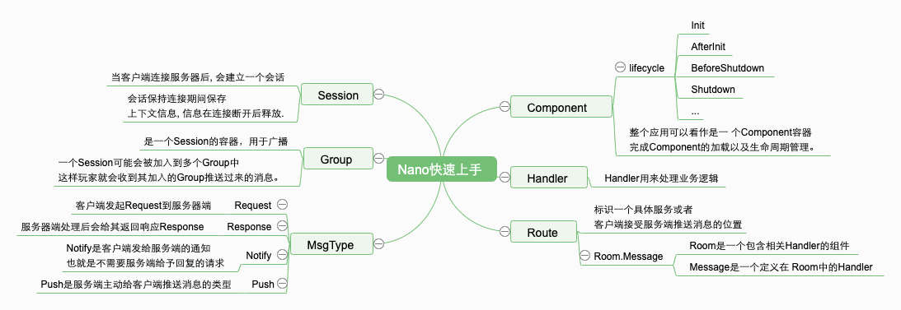

# 探索 Golang 高实时 Web 应用 &amp; 轻量级游戏服务器端编程

`5G 时代的到临，高实时应用应该会有所爆发……`

### 本笔记📒阅读前置知识

* 感兴趣就好(不懂的知识 `google` 都会给你🆙)
* 基本的服务端知识(最好有 Golang 基础)

本系列教程将以 [Nano](https://github.com/lonng/nano)(Lightweight, facility, high performance golang based game server framework) 项目为探索对象。

* 它是一个轻量级的项目，可以很好的让我们入门 ` Golang 高实时 Web 应用`
* 重量级 MMORPG 框架目前不在此讨论范围内🤣

Server 端源码分析项目：[NanoServer](https://github.com/lonng/nanoserver)

* 大家也可以直接看源码学习，不用管我下面👇的废话🤣（快速应用于自己业务线才是最重要的）

为什么选择 Nano？

* 很多项目很美，但并没有提供一个合适(太大 or 太小)的、完整的、可应用于生产的的业务示例(也许是我没有找到合适的🤦‍♀️)

针对 Apk：[Android逆向破解：Android Killer使用](https://www.jianshu.com/p/61a93a6c0c1b)

由于没有客户端并没有开源（比较蛋疼🤦‍♀️）

我这边会陆陆续续使用 [Cocos Creator](https://www.cocos.com/creator) 去开发一套完整的客户端并且开源。

### Nano 基本术语脑图
脑图是根据 [如何构建你的第一个nano应用](https://github.com/lonng/nano/blob/master/docs/get_started_zh_CN.md) 来整理的。

### NanoServer 整体架构(🙅‍♀️🙅‍♂️不要在此意淫分布式，微服务，DevOps……☞这里旨在先入门🤣)

