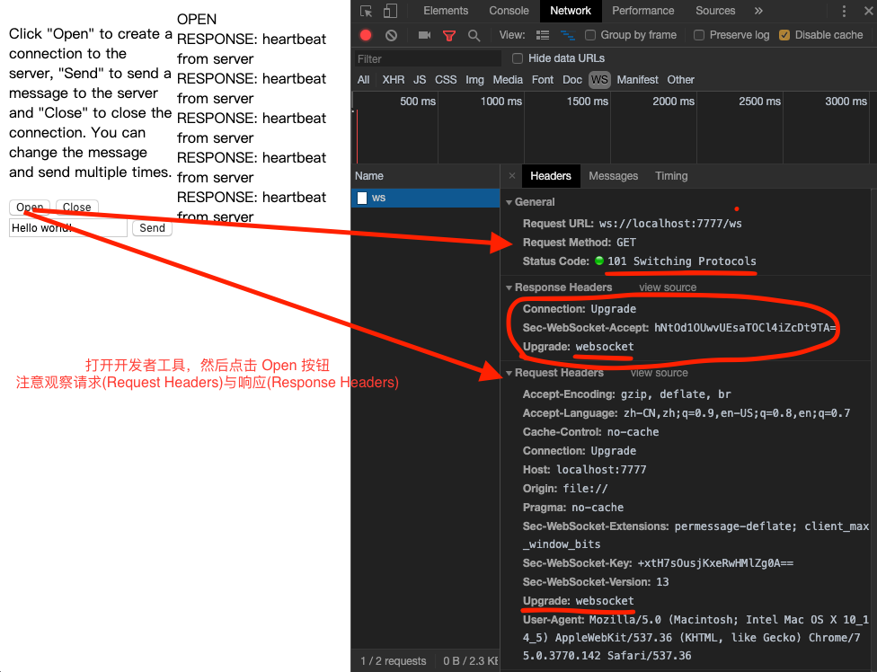
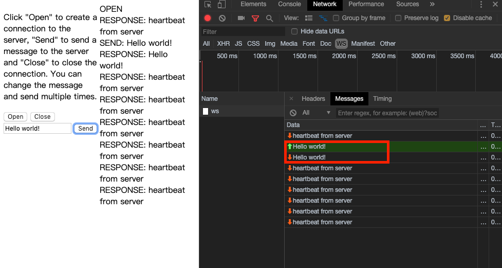

# 探索 Golang 高实时应用 &amp; 轻量级游戏服务端编程

`5G 时代的到临，高实时应用应该会有所爆发……`

互联网项目始终也一直在优化的三高(没有最好，只有更好🤦‍♀️)：
* 高性能
* 高并发
* 高可用

画图工具
  * [draw.io](https://www.draw.io/)
  * [百度脑图](https://naotu.baidu.com/)

### 本笔记📒阅读前置知识

* 感兴趣就好(不懂的知识 `Google` 都会给你🆙)
* 基本的服务端知识(最好有 Golang 基础)
* 有 Docker 知识的话，几乎所有的实验环境你都能快速的构造出来

本系列教程将以 [Nano](https://github.com/lonng/nano)(Lightweight, facility, high performance golang based game server framework) 项目为探索对象。

* 它是一个轻量级的项目，可以很好的让我们入门 ` Golang 高实时 Web 应用`
* 重量级 MMORPG 框架目前不在此讨论范围内🤣

Server 端项目源码分析对象
  * [go-websocket](https://github.com/owenliang/go-websocket)
  * [go-push](https://github.com/owenliang/go-push)
  * [NanoServer](https://github.com/lonng/nanoserver)
  * 大家也可以直接看源码学习，不用管我下面👇的废话🤣（快速应用于自己业务线才是最重要的）

为什么选择 Nano？

* 很多项目很美，但并没有提供一个合适(太大 or 太小)的、完整的、可应用于生产的的业务示例(也许是我没有找到合适的🤦‍♀️)

针对 Apk：[Android逆向破解：Android Killer使用](https://www.jianshu.com/p/61a93a6c0c1b)

由于客户端并没有开源（比较蛋疼🤦‍♀️）

我这边会陆陆续续使用 [Cocos Creator](https://www.cocos.com/creator) 去开发一套完整的客户端并且开源。

### 快速上手 GO & WebSocket

视频教程：[GO实现千万级WebSocket消息推送服务](https://www.imooc.com/learn/1025)
* 非常好的扫盲教程
* 如果你从来没有接触过 WebSocket，那么你一定要看一下

示例源码：[go-websocket](https://github.com/owenliang/go-websocket) & [go-push](https://github.com/owenliang/go-push)
* 一些 DevOps 额外话(也许你不需要关注……)
* 关于如何优雅的部署(traffic,k8s,docker,swarm……说实话相关内容还挺多的🤦‍♀️)
* 本地可以采用 [Vagrant + VirtualBox] 或 [Docker Machine + VirtualBox] 快速搭建实验环境,可以参看我的[DevOps](https://github.com/Kirk-Wang/DevOps)仓库

以下文字是针对上述视频的脱敏处理(`感谢小鱼儿大佬提供如此通俗易懂的入门教程`)

#### 什么是推送系统？

#### 弹幕系统的技术挑战

技术复杂度：

1 个直播间
* 在线人数：100万
* 发送弹幕：1000条/秒
* 推送频率：100万 * 1000条/秒 = 10亿/秒

N 个直播间
* 推送频率：N * 10亿/秒 (有点可怕了，怕老板钱不够🤣……)

#### 拉模式与推模式的区别

拉模式
* 服务端数据更新频率低，则大多数请求是无效的
* 在线用户数量多，则服务端的查询负载高
  * 100万人同时轮询，相当于 DDOS 攻击了，对服务端不可接受
* 定时轮询拉取，无法满足时效性要求

推模式
* 仅在数据更新时才需要推送
* 需要维护大量的在线长连接
* 数据更新后可以立即推送

基于 WebSocket 推送
* 浏览器支持的socket编程，轻松维持服务端的长连接
* 基于TCP可靠传输之上的协议，无需开发者关心通讯细节
* 提供高度抽象的编程接口，业务开发成本较低

#### WebSocket 协议与交互(`必备基础`)

传输原理

* 客户端与服务端之间首先要完成一次握手🤝的操作
* 握手本身是基于 HTTP 调用完成的
* 客户端首先发送一条 HTTP 请求到服务端
  * 请求的特殊之处在于，它 Header 里面带了一个 `upgrade` 字段
  * 它告诉服务端，我想要升级为 WebSocket 协议
* 服务端收到之后，就会响应一个握手🤝的确认 `switching`
  * `switching` 的意思就是说，服务端已经允许你向 `websocket` 协议转换了
* 一旦完成协商后(当然，此时客户端与服务端的底层 TCP 连接应该是没有中断的)
  * 协议升级后，继续复用 HTTP 的底层 Socket 完成后续通讯
  * 实际的传输单元是 `message`
  * `websokcet` 的 `message` 是我们实际编程的一个基本单位
    * 但实际上，`message` 底层被切分为多个 `frame` 帧传输
    * 目的是从协议层面，它不能传输一个大包，它会把它切成一个个小包在网络上传输
    * 编程时只需操作 `message`，无需关心 frame
    * 框架底层完成 TCP 网络 I/O，WebSocket 协议解析，开发者无需关心
* 接下来，`客户端`就可以向`服务端`发送基于`websocket`协议的 `message` (消息)
* `服务端`也可以主动向`客户端`发送基于`websocket`协议的 `message` (消息)

#### 抓包观察，弄清楚我们能做推送的依据(`非常重要`)
* 使用 Chrome 开发者工具，观察 WebSocket 通讯流程
  * 从握手到后续消息的收发，到底经历了什么？
* [go-websocket](https://github.com/owenliang/go-websocket)
  * Down下来，自己感受一下
  * 后续，我会弄成一个 Docker Image(ToDo)

#### 服务端的技术选型与考虑

NodeJS
* 最常听到的做 websocket 通讯，比较普及
  * websocket 本身是浏览器端的一种编程，前端同学又比较擅长 NodeJS，网上又有很多博客去介绍
* 但是这里面有个问题
  * 单线程模型(虽然它能多进程)，推送性能有限
  * 但是多进程不太适合做推送，因为我们需要遍历在线用户集合
  * 多进程连接被散列在多个进程上，不放便做
  * 我们希望还是多线程的比较好
* 它是解释性语言

C/C++
* 轮子太少（当然，如果你有很强的 C/C++ 背景，那么它是最好的🤣）
  * TCP 通讯、WebSocket 协议实现成本高

Go
* 多线程，基于协程模型并发
  * 对于开发人员非常友好，能快速写好多线程，高并发的程序
  * 编译性语言，意味着它的运行速度并不慢
* 成熟的 WebSocket 标准库，无需造轮子
  * 满足百万用户推送的处理
  * 也不需要特别关心协议的细节
  * 可直接进入到业务中，这才是对我们最有价值的部分

#### 实现 HTTP 服务端
* WebSocket 是 HTTP 协议 Upgrade 而来
* 使用 http 标准库快速实现空接口：/ws
  * 配置路由
  * 监听服务

#### 完成 WebSocket 握手
* 使用 websocket.Upgrader 完成协议握手，得到 WebSocket 长连接
  * 握手具体操作交给标准库去操作
    * upgrader := websocket.Upgrader{ CheckOrigin: func }
    * upgrader.Upgrade(w, r, nil)
* 操作 websocket api, 读取客户端消息，然后原样发送回去

#### 封装 WebSocket

缺乏工程化的设计
* 其它代码模块，无法直接操作 WebSocket 连接
* WebSocket 连接非线程安全，并发读/写需要同步手段
  * ReadMessage & WriteMessage 同一时刻只能有一个代码调用

隐藏细节
* 封装Connection结构，隐藏 WebSocket 底层连接
* 封装Connection的API，提供 Send/Read/Close 等线程安全接口
* 这里会有编码与思考的脑图(ToDo)

API原理
* SendMessage 将消息投递到 out channel
* ReadMessage 从 in channel 读取消息
* channel 是线程安全的

内部原理
* 启动读协程，循环读取WebSocket，将消息投递到 in channel
* 启动写协程，循环读取 out channel，将消息写给WebSocket

#### 千万级弹幕系统的架构秘密 

分析技术难点：

3个性能瓶颈
* 内核瓶颈
* 锁瓶颈
* CPU瓶颈

内核瓶颈
* 推送量大：100万在线 * 10条/秒 = 1000万条/秒
* linux 内核发送 TCP 的极限包频 ≈ 100万条/秒

锁瓶颈
* 需要维护在线用户集合（100万在线），通常是一个字典结构
* 推送消息即遍历整个集合，顺序发送消息，耗时极长
* 推送期间，客户端仍旧正常上/下线，所以集合需要上锁
  * 上锁期间，客户端无法正常上/下线问题(拿不到锁)？

CPU 瓶颈
* 浏览器服务端通常采取 json 格式通讯
* json 编码非常耗费 CPU 资源
* 向 100 万在线推送一次，则需100万次 json encode
  * 平时1000，2000 QPS 压根感受不出来

技术难点的解决方案

内核瓶颈-优化原理
* 减少网络小包的发送
  * 网络小包（几百字节的就算是网络上的小包）
  * 网络小包，对内核以及网络上的中间设备都会造成一个处理的压力

内核瓶颈-优化方案
* 将同一秒内的 N 条消息，合并成一条消息
* 合并后，每秒推送的次数只等于在线连接数
  * 100万在线
    * 10条/秒 --> 将 10 条合并成一条
    * 20条/秒 --> 将 20 条合并成一条
  * 这样只需要推100万次
--------------------------------

### Nano 基本术语脑图
脑图是根据 [如何构建你的第一个nano应用](https://github.com/lonng/nano/blob/master/docs/get_started_zh_CN.md) 来整理的。

### NanoServer 整体架构
`🙅‍♀️🙅‍♂️先不要在此意淫分布式架构，微服务架构，DevOps……☞这里旨在先上手后演变🤣`

